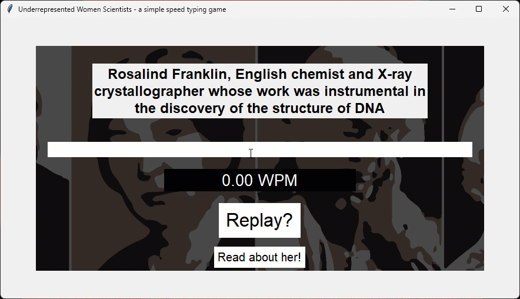
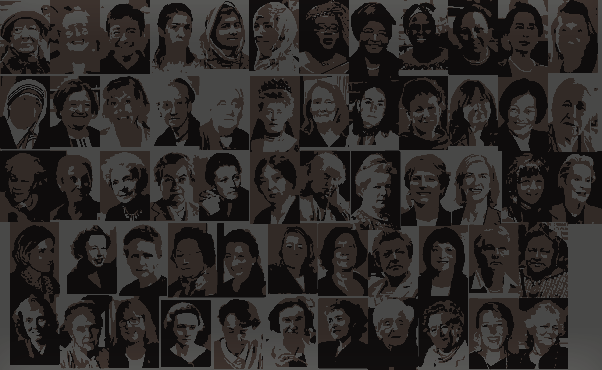

# **QWERTY Queens: Remarkable Women in STEM**
<p>

### **Motivation**: This is a very simple speed typing game I created during ~~procrastination~~ my free time. I wanted to practice Python, get some experience on GUI, and work on something different than bioinformatics. Given the recent International Day of Women and Girls in Science (and being the son of a woman in science), I used sentences with the name and a brief description of the work of several women in STEM. I also included a button to redirect the user to the Wikipedia page of the women in question. Despite being just a pastime project, I hope this encourages players to learn more about the contributions of women in STEM fields. I also created the background using the Wikipedia images from all women Nobel laureates involved in science. You go, girls!

</br>
<p align = "center"



</br>

### "*The most exciting phrase to hear in science, the one that heralds new discoveries, is not 'Eureka!' but 'That's funny...*'" - Isaac Asimov (said by Rosalind Franklin)

</p>
</br>

```
The only requirement to run the code, in addition to Python 3.9+, is tkinter v8.6.12.
To run the game, simply run fasty.py in your desired environment.
```

<p align="center">
</br>

</p>
</br>

# LF Piochi